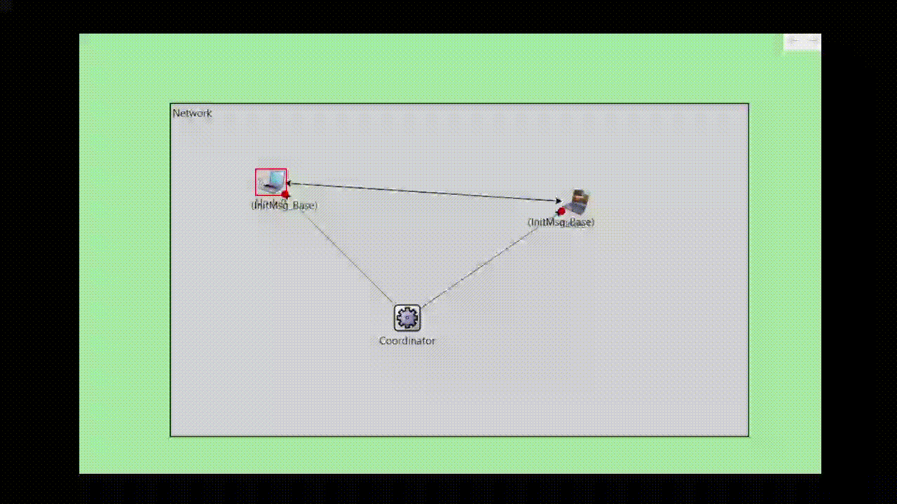

# Data Link Layer Protocol Simulation
Selective repeat algorithm implementation for data link layer protocol simulation.

## Table of contents
* [Technologies](#technologies)
* [Overview](#overview)
* [How to run](#how-to-run)
* [Contributors](#contributors)
* [References](#references)

## Technologies
Project was created with:
* C++
* Omnet++

## Overview

Our team has successfully implemented the Data Link Layer Protocol Simulation project. Throughout the implementation process, we developed, simulated, and tested data link layer protocol between two nodes connected via a noisy channel. This project aimed to address the challenges of non-error-free transmission, including packet corruption, duplication, delay, and loss, while ensuring the robustness of the protocol.

### System Inputs

- Each node read its list of messages from different input text files: `input0.txt` for Node0 and `input1.txt` for Node1.
- Messages in the input files were preceded by a 4-bit binary prefix indicating the possibility of modification, loss, duplication, or delay.
- Error indicators were represented in a binary format (4 bits), where each bit location indicated the presence of a certain error type.

### Coordinator Functionality

- The coordinator initialized the system, assigning which node of the pair should start and when.
- Initialization information was retrieved from an input file named `coordinator.txt`.

### Parameters Configuration

- System parameters such as sender window size (WS), receiver window size (WR), timeout interval (TO), processing time (PT), transmission delay (TD), error delay (ED), and duplication delay (DD) were configured in the `.ini` file.

### System Outputs

- The system generated a log file named `output.txt`, containing details for each message transmission from both nodes.
- Log entries included timestamps, node IDs, frame details, error indicators, and delays.

### Selective Repeat Protocol

- We successfully implemented the Selective Repeat protocol considering timeout, window size, and the noisy channel.
- Sender and receiver nodes communicated using data and control frames (ACK/NACK).
- The simulation ended when the sender node finished sending all messages and received all corresponding ACKs.

## How to run
1. Download and install [Omnet++](https://omnetpp.org/download/).
2. Clone the repository.
3. Open Omnet++ and import the project.
4. Run the project.

## Contributors
* [Omar Elzahar](https://github.com/omarelzahar02)
* [Salah Abotaleb](https://github.com/SalahAbotaleb)
* [Hussien Elhawary](https://github.com/Hussein-Elhawary)
* [Moaaz Tarek](https://github.com/moa234)

## References
[Cairo University - Computer Engineering Department Project Description](https://drive.google.com/file/d/1HpRMDpOPdIfru4qLNrdDsBQ2n-kIKqKL/view?usp=sharing)

